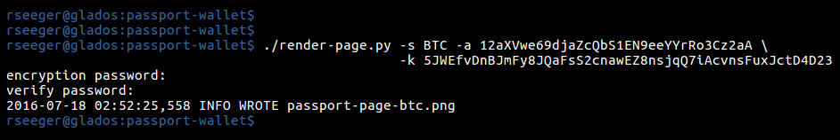
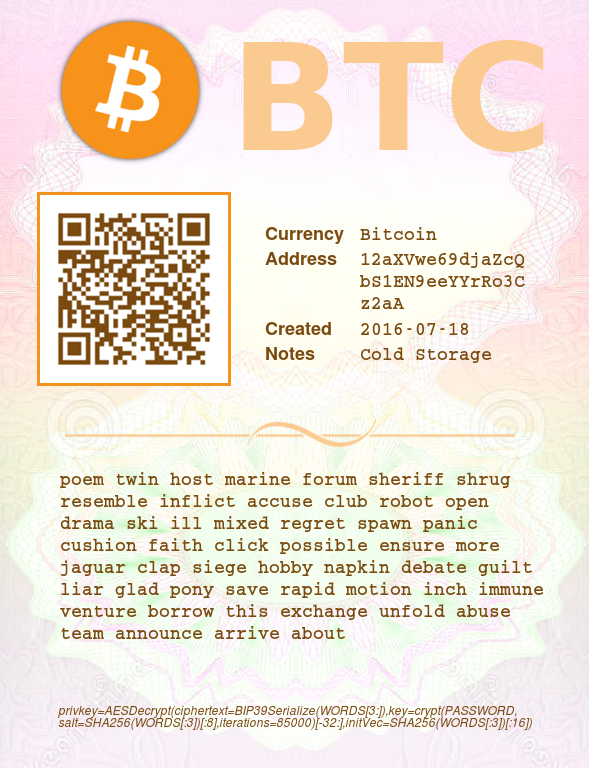
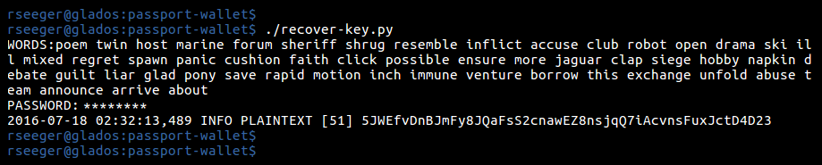
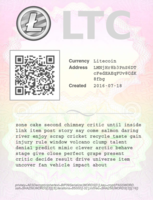
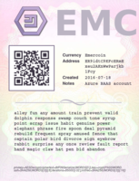

# Passport wallet

## Motivation

The benefit of paper wallets is that they are technically un-hackable
since the keys never exist online to be hacked in the first place (if
the key pair is generated offline). However, there is another problem:
the "paper" must be stored securely in the REAL world. Anyone who
obtains a copy can access your account. It's risky even to print paper
wallets because many printers keep copies of historic print jobs in
local storage.

Password encrypted paper wallet protocols such as [BIP-38](https://github.com/bitcoin/bips/blob/master/bip-0038.mediawiki)
are not universal. It is convenient and desirable to have a universal
encrypted paper wallet protocol that can be used for any
crypto-currency. The encryption step should therefore be generic.

## Features

The `render-page.py` script generates a secure paper wallet for any
crypto-currency key pair. A QR code on the paper wallet links to the
block explorer for the public address in order to quickly verify the
current balance while the private key is AES-encrypted with
key-stretching and transformed into a BIP-39-style word sequence
writted to a PNG image file.

## Sample usage

You must provide at minimum the currency symbol, a public address, and
a private key. The default block explorer is pulled from the
`assets.csv` file, and the currency logo is pulled from the `images`
directory assuming the format `icon-[SYMBOL].png`.

For help on the different options, run: `render-page.py -h`

Use `recover-key.py` to recover the private key. Just enter the word sequence and your password:

## Notes

The output of `render-page.py` is a single PNG file with design
elements similar to a page in a passport with the idea that several
small pages will be combined into a concise booklet. The color scheme
is automatically derived from the colors in the library of currency
logos. The ideal use case for the Passport Wallet is: secure
cold-storage for a portfolio of crypto-currencies where the wallets
themselves can be viewed by others without compromising security.

Sample passport pages:

    
