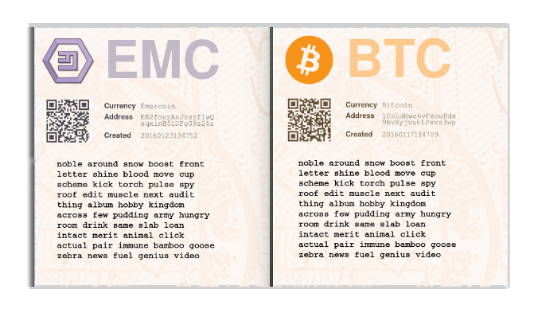

# passport-wallet

Generates a booklet of paper-wallets for a portfolio of crypto-currencies. Each page contains the details for one currency including a public key with a QR code and a private key generically encoded as:

> `WORD_SEQ = bip39_encode(aes_encrypt(PRIV_KEY, bcrypt(PASSWORD, rounds=14)))`

bcrypt is used for key stretching where one password guess should take about 10 seconds on a modern laptop. The bip39 dictionary of 2048 words maps every 11 bits of encrypted data to an english word as output.

The private keys are then recovered with:

> `PRIV_KEY = aes_decrypt(bip39_decode(WORD_SEQ), bcrypt(PASSWORD, rounds=14))`

